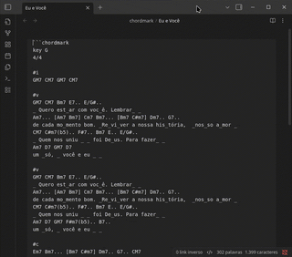

# Obsidian ChordMark

Um plugin para o [Obsidian](https://obsidian.md) que renderiza cifras musicais de forma elegante, utilizando a poderosa biblioteca [chord-mark](https://github.com/no-chris/chord-mark).



## 🚀 Como Usar

Basta criar um bloco de código usando a linguagem `chordmark`:

    ```chordmark
    key C
    3/4

    #v
    C G
    _Esta é uma _linha de teste
    Am F
    Com acor_des alinhados _
    ```

### Sintaxe Suportada

O plugin suporta toda a sintaxe do `chord-mark`:
- `C`, `Dm7`, `G/B`: Acordes são detectados automaticamente.
- `_`: Use underline para marcar exatamente onde o acorde deve cair na letra.
- `#v`, `#c`, `#b`: Etiquetas para Verso, Refrão, Ponte...

## 📦 Instalação Manual

Como este plugin ainda não está na loja oficial do Obsidian, você pode instalá-lo manualmente:

1. Baixe a última versão (ou compile o código).
2. Crie uma pasta `chordmark` dentro de `.obsidian/plugins/` no seu cofre.
3. Copie os arquivos `main.js`, `manifest.json` e `style.css` para lá.
4. Reinicie o Obsidian e ative o plugin em **Community Plugins**.